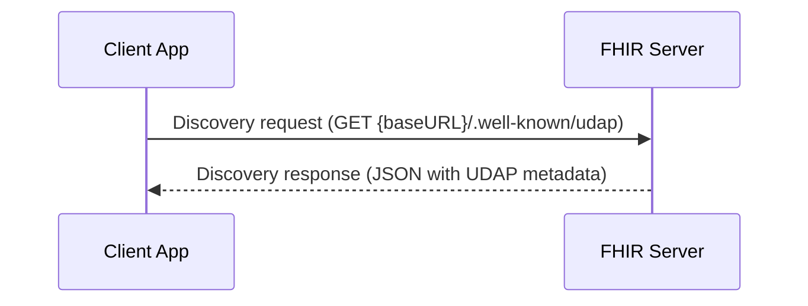
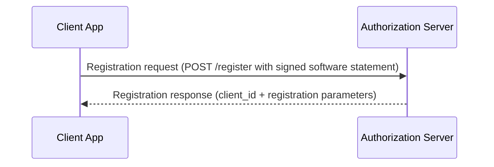
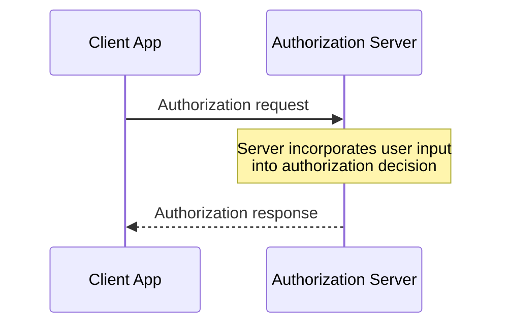
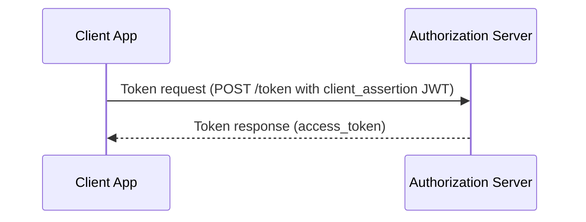
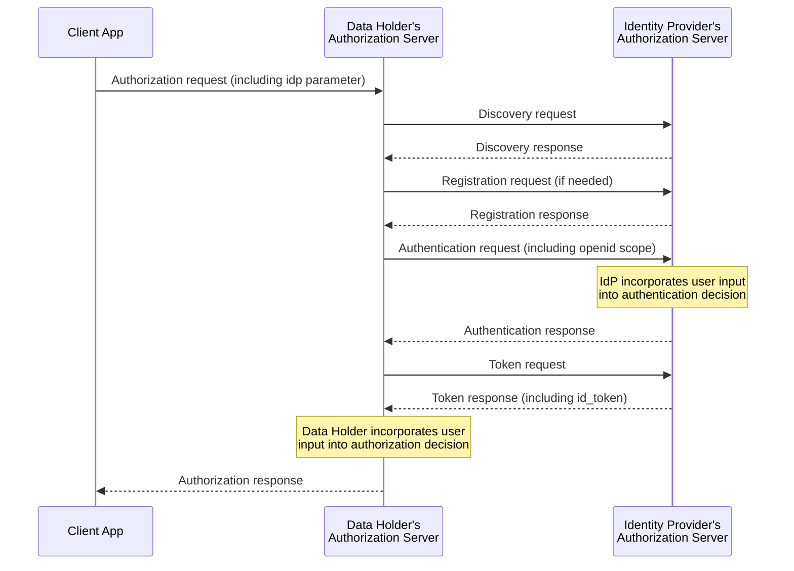

# Security for Scalable Registration, Authentication, and Authorization (SSRAA) v2.0.0

| Metadata | Value |
| :--- | :--- |
| Package | hl7.fhir.us.udap-security#2.0.0 |
| FHIR Version | 4.0.1 |
| IG Status | Active (Trial-use, Maturity Level 4) |
| Date | 2025-07-28 |
| Publisher | HL7 International / Security |
| URL | http://hl7.org/fhir/us/udap-security/ImplementationGuide/hl7.fhir.us.udap-security |

# Home - Security for Scalable Registration, Authentication, and Authorization v2.0.0


## Home


This Security FHIR® IG has been established upon the recommendations of ONC’s FHIR at Scale Taskforce (FAST) Security Tiger Team, and has been adapted from IGs previously published by UDAP.org. This IG is based on the UDAP STU1 profiles. The workflows defined in the Unified Data Access Profiles (UDAP™) have been used in several FHIR IGs, including the TEFCA Facilitated FHIR IG, Carequality FHIR IG, Carin BB IG, DaVinci HREX IG, and others. The objective of this IG is to harmonize workflows for both consumer-facing and B2B applications to facilitate cross-organizational and cross-network interoperability.

Additional enhancements include a formal definition for a B2B Authorization Extension Object to facilitate these transactions.

### Introduction

This implementation guide describes how to extend OAuth 2.0 using UDAP workflows for both consumer-facing apps that implement the authorization code flow, and business-to-business (B2B) apps that implement the client credentials flow or authorization code flow. This guide covers automating the client application registration process and increasing security using asymmetric cryptographic keys bound to digital certificates to authenticate ecosystem participants. This guide also provides a grammar for communicating metadata critical to healthcare information exchange.

The requirements described in this guide are intended to align with the proposed solutions of the ONC FHIR at Scale Taskforce’s Security Tiger Team, the security model and UDAP workflows outlined in the [Carequality FHIR-Based Exchange IG](https://carequality.org/wp-content/uploads/2020/12/Carequality-FHIR-Implementation-Guide.pdf), and implementation guides incorporating UDAP workflows published by the [CARIN Alliance](http://hl7.org/fhir/us/carin-bb/STU1/Authorization_Authentication_and_Registration.html#authorization-and-authentication) and the [Da Vinci Project](http://hl7.org/fhir/us/davinci-hrex/STU1/smart-app-reg.html).

This Guide is divided into several pages which are listed at the top of each page in the menu bar.

* [Home](index.md): The home page provides the introduction and background for this project, and general requirements that apply to all workflows described in this guide.
* [Discovery](discovery.md): This page describes how clients can discover server support for the workflows described in this guide.
* [Registration](registration.md): This page describes workflows for dynamic registration of client applications.
* [Consumer-Facing](consumer.md): This page provides detailed guidance for authorization and authentication of consumer-facing apps.
* [Business-to-Business](b2b.md): This page provides detailed guidance for authorization and authentication of B2B apps.
* [Tiered OAuth for User Authentication](user.md): This page provides detailed guidance for user authentication.
* [General Requirements](general.md): This page provides general requirements applicable to multiple authorization and authentication workflows.
* [FHIR Artifacts](artifacts.md): This page provides additional conformance artifacts for FHIR resources.

Guidance regarding the use of this IG with the SMART App Launch Framework can be found in [Section 7.5](general.md#using-this-guide-with-the-smart-app-launch-framework).

### Trust Community Checklist

A trust community is a group of member entities that has come together to support one or more interoperability use cases between its members. Typical examples of trust communities include health information networks and interoperability frameworks (e.g. a network of networks). Trust communities may be defined by geography (e.g. regional, national, international) or any other criteria (e.g. affiliated healthcare organizations, users of a common technology platform, support of specific use cases required by regulation, etc.).

This guide provides a technical framework to securely scale FHIR transactions within a trust community using X.509 certificates as the basis of community trust, including both consumer-facing and B2B workflows. It is expected that trust communities will establish agreements and policies to address certain community-specific parameters in this guide, as well as non-technical aspects necessary for interoperability, e.g. criteria for community membership, data-sharing agreements, certificate issuance policies, etc.

Additional topics to be addressed by trust communities adopting this guide are listed below:

1. Assignment of unique URIs to servers for use in certificates and in the`iss`and`sub`claims of signed metadata elements (see[Section 2.3](discovery.md#signed-metadata-elements)).
1. URI used to identify the community in metadata requests (see[Section 2.4](discovery.md#multiple-trust-communities)).
1. Assignment of unique URIs to client applications for use in certificates and in the`iss`and`sub`claims of software statements (see[Section 3.1](registration.md#software-statement)).
1. Assignment of unique URIs to organizational requestors for use in a B2B Authorization Extension Object (see`organization_id`in[Section 5.2.1.1](b2b.md#b2b-authorization-extension-object)).
1. Minimum set of scopes that servers must support (see`scopes_supported`in[Section 2.2](discovery.md#required-udap-metadata)).
1. Allowed values for requestor roles in a B2B Authorization Extension Object (see`subject_role`in[Section 5.2.1.1](b2b.md#b2b-authorization-extension-object)).
1. Permitted purposes of use for which data may be requested in a B2B Authorization Extension Object (see`purpose_of_use`in[Section 5.2.1.1](b2b.md#b2b-authorization-extension-object)).
1. Consent and authorization policies that may be asserted in a B2B Authorization Extension Object and supporting documentation (see`consent_policy`and`consent_reference`in[Section 5.2.1.1](b2b.md#b2b-authorization-extension-object)).
1. Time synchronization between community participants.
1. PKI policies including policies for certificate issuance and distribution.
1. Other community policies or conditions that an actor may need to meet before exchanging data with community participants or with other trust communities. Examples include community legal agreements, certificate policies, policies regarding what claims an actor has the authority to assert, and other community requirements relating to the specific use cases, client types and/or grant types supported by the community.

---

# Discovery - Security for Scalable Registration, Authentication, and Authorization v2.0.0


## Discovery

The requirements in this section are applicable to both consumer-facing and B2B apps and the servers that support them. The client and the server **SHALL** conform to the underlying server metadata profile in [UDAP Server Metadata](https://www.udap.org/udap-server-metadata-stu1.html).

### Discovery of Endpoints

A FHIR Server **SHALL** make its Authorization Server’s authorization, token, and registration endpoints, and associated metadata available for discovery by client applications. Servers **SHALL** respond to `GET` requests to the following metadata URL by unregistered client applications and without requiring client authentication, where {baseURL} represents the base FHIR URL for the FHIR server: {baseURL}/.well-known/udap

The discovery workflow is summarized in the following diagram:



UDAP metadata **SHALL** be structured as a JSON object as per Section 1 of [UDAP Server Metadata](https://www.udap.org/udap-server-metadata-stu1.html#section-1) and discussed further in [Section 2.2](discovery.md#required-udap-metadata).

If a server returns a `404 Not Found` response to a `GET` request to the UDAP metadata endpoint, the client application **SHOULD** conclude that the server does not support UDAP workflows.

### Required UDAP Metadata

The metadata returned from the UDAP metadata endpoint defined above **SHALL** represent the server’s capabilities with respect to the UDAP workflows described in this guide. If no UDAP workflows are supported, the server **SHALL** return a `404 Not Found` response to the metadata request. For elements that are represented by JSON arrays, clients **SHALL** interpret an empty array value to mean that the corresponding capability is NOT supported by the server.

| | | |
| :--- | :--- | :--- |
| `udap_versions_supported` | required | A fixed array with one string element:`["1"]` |
| `udap_profiles_supported` | required | An array of two or more strings identifying the core UDAP profiles supported by the Authorization Server. The array**SHALL**include:`"udap_dcr"`for UDAP Dynamic Client Registration, and`"udap_authn"`for UDAP JWT-Based Client Authentication.If the`grant_types_supported`parameter includes the string`"client_credentials"`, then the array**SHALL**also include:`"udap_authz"`for UDAP Client Authorization Grants using JSON Web Tokens to indicate support for Authorization Extension Objects.If the server supports the user authentication workflow described in[Section 6](user.md#tiered-oauth-for-user-authentication), then the array**SHALL**also include:`"udap_to"`for UDAP Tiered OAuth for User Authentication. |
| `udap_authorization_extensions_supported` | required | An array of zero or more recognized key names for Authorization Extension Objects supported by the Authorization Server. If the Authorization Server supports the B2B Authorization Extension Object defined in[Section 5.2.1.1](b2b.md#b2b-authorization-extension-object), then the following key name**SHALL**be included:`["hl7-b2b"]` |
| `udap_authorization_extensions_required` | conditional | An array of zero or more recognized key names for Authorization Extension Objects required by the Authorization Server in every token request. The array**SHALL NOT**include key names that are not also elements of the`udap_authorization_extensions_supported`array. This metadata parameter**SHALL**be present if the value of the`udap_authorization_extensions_supported`parameter is not an empty array. If the Authorization Server requires the B2B Authorization Extension Object defined in[Section 5.2.1.1](b2b.md#b2b-authorization-extension-object)in every token request, then the following key name**SHALL**be included:`["hl7-b2b"]` |
| `udap_certifications_supported` | required | An array of zero or more certification URIs supported by the Authorization Server, e.g.:`["https://www.example.com/udap/profiles/example-certification"]` |
| `udap_certifications_required` | conditional | An array of zero or more certification URIs required by the Authorization Server. The array**SHALL NOT**include certification URIs that are not also elements of the`udap_certifications_supported`array. This metadata parameter**SHALL**be present if the value of the`udap_certifications_supported`parameter is not an empty array. Example:`["https://www.example.com/udap/profiles/example-certification"]` |
| `grant_types_supported` | required | An array of one or more grant types supported by the Authorization Server, e.g.:`["authorization_code", "refresh_token",  "client_credentials"]`The`"refresh_token"`grant type**SHALL**only be included if the`"authorization_code"`grant type is also included. |
| `scopes_supported` | required | An array of one or more strings containing scopes supported by the Authorization Server. The server**MAY**grant different subsets of these scopes for different client types or entities. Example for a server that also supports SMART App Launch v1 scopes:`["openid", "launch/patient", "system/Patient.read", "system/AllergyIntolerance.read", "system/Procedures.read"]` |
| `authorization_endpoint` | conditional | A string containing the absolute URL of the Authorization Server's authorization endpoint. This parameter**SHALL**be present if the value of the`grant_types_supported`parameter includes the string`"authorization_code"` |
| `token_endpoint` | required | A string containing the absolute URL of the Authorization Server's token endpoint for UDAP JWT-Based Client Authentication. |
| `token_endpoint_auth_methods_supported` | required | Fixed array with one value:`["private_key_jwt"]` |
| `token_endpoint_auth_signing_alg_values_supported` | required | Array of strings identifying one or more signature algorithms supported by the Authorization Server for validation of signed JWTs submitted to the token endpoint for client authentication. For example:`["RS256", "ES384"]` |
| `registration_endpoint` | required | A string containing the absolute URL of the Authorization Server's registration endpoint. |
| `registration_endpoint_jwt_signing_alg_values_supported` | required | Array of strings identifying one or more signature algorithms supported by the Authorization Server for validation of signed software statements, certifications, and endorsements submitted to the registration endpoint. For example:`["RS256", "ES384"]` |
| `signed_metadata` | required | A string containing a JWT listing the server's endpoints, as defined in[Section 2.3](#signed-metadata-elements)below. |

FHIR servers with the same `registration_endpoint` URL belong to the same logical group. A registration for any FHIR server in this logical group registers the client application for all endpoints in that group.

The above paragraph is informational and reflects deployment models that may be encountered in the real world. This guide does not currently expect or require client applications to track registration endpoints or logical groups when determining whether or not registration is necessary, nor does it expect registration endpoint URLs published by servers to be static. Implementers should be aware of the possible side effects when different registration parameters are requested for two FHIR servers in the same logical group, i.e. the second registration at the same registration endpoint URL will modify the first registration as discussed in [Section 3.4](registration.md#modifying-and-cancelling-registrations) of this guide. Implementer feedback is requested to determine if additional client and/or server requirements relating to this topic should be added in the future.

A FHIR Server **MAY** include additional metadata elements in its metadata response as described in [UDAP Server Metadata](https://www.udap.org/udap-server-metadata-stu1.html). However, a conforming client application might not support additional metadata elements.

### Signed metadata elements

A server’s UDAP metadata **SHALL** include the `signed_metadata` element. The value of this element is a JWT constructed as described in [Section 7.1](general.md#json-web-token-jwt-requirements) and containing the claims in the table below. This JWT **SHALL** be signed using the [RS256](general.md#signature-algorithm-identifiers) signature algorithm. Metadata values conveyed in the signed metadata **SHALL** take precedence over the corresponding values conveyed using plain JSON elements.

| | | |
| :--- | :--- | :--- |
| `iss` | required | Issuer of the JWT -- unique identifying server URI. This**SHALL**match the value of a uniformResourceIdentifier entry in the Subject Alternative Name extension of the server's certificate included in the`x5c`JWT header, and**SHALL**be equal to the server's {baseURL} |
| `sub` | required | Same as`iss`. |
| `exp` | required | Expiration time integer for this JWT, expressed in seconds since the "Epoch" (1970-01-01T00:00:00Z UTC). The`exp`time**SHALL**be no more than 1 year after the value of the`iat`claim. |
| `iat` | required | Issued time integer for this JWT, expressed in seconds since the "Epoch" |
| `jti` | required | A nonce string value that uniquely identifies this JWT. See[Section 7.1.4](general.md#jwt-claims)for additional requirements regarding reuse of values. |
| `authorization_endpoint` | conditional | A string containing the absolute URL of the server's authorization endpoint,**REQUIRED**if the`authorization_endpoint`parameter is included in the unsigned metadata |
| `token_endpoint` | required | A string containing the absolute URL of the server's token endpoint |
| `registration_endpoint` | required | A string containing the absolute URL of the server's registration endpoint |

The client **SHALL** validate the signed metadata returned by the server as per Section 3 of [UDAP Server Metadata](https://www.udap.org/udap-server-metadata-stu1.html). If the signed metadata fails validation for any reason, the client **SHALL NOT** proceed with the workflows in this guide.

Note: The use of the `signed_metadata` parameter in this guide is intended to align with [Section 2.1 of RFC 8414](https://datatracker.ietf.org/doc/html/rfc8414#section-2.1). However, the requirements specified in this section are stricter than the corresponding requirements in RFC 8414.

### Multiple Trust Communities

A server that participates in more than one trust community may be issued different certificates from each community. However, the serialization method used to sign server metadata in the previous section of this guide requires the server to select only one certificate for use in assembling the signed JWT returned for the `signed_metadata` element. This can lead to scenarios where a client application might not trust the certificate that was selected by the server, but would have trusted one of the server’s other certificates for a different trust community.

To address this, a client application **SHOULD** add the optional query parameter `community` to the metadata request URL described in [Section 2.1](discovery.md#discovery-of-endpoints) to indicate that it trusts certificates issued by the community identified by the parameter value. The value of the parameter **SHALL** be a URI as determined by the trust community for this purpose.

Servers **SHALL** support the `community` parameter. IF a client includes this parameter in its metadata request and the server recognizes the community URI, the server **SHALL** select a certificate intended for use within the identified trust community, if it has been issued such a certificate, and use that certificate when generating the signed JWT returned for the `signed_metadata` element. If a server supports different UDAP capabilities for different communities, it **MAY** also return different values for other metadata elements described in [Section 2.2](discovery.md#required-udap-metadata) as appropriate for the identified community. If the server does not recognize the community URI or does not have a suitable certificate for the identified community, it **MAY** return a `204 No Content` response to the metadata request to indicate that no UDAP workflows are supported by server in the context of that community, or it **MAY** return its default metadata, i.e. the metadata that it would have returned if the `community` parameter was not included in the request.

Note: The authors recommend that the client be prepared to handle server metadata signed with a key for a different trust community than expected, regardless if the community parameter was used. If the client cannot validate the server’s signed metadata because the server’s certificate is from a different community that is not trusted by the client, then the client will terminate the workflow as per the validation requirements in the previous section.

---

# Registration - Security for Scalable Registration, Authentication, and Authorization v2.0.0


## Registration

The requirements in this section are applicable to both consumer-facing and B2B apps and the servers that support them.

Before FHIR data requests can be made, Client application operators **SHALL** register each of their applications with the Authorization Servers identified by the FHIR servers with which they wish to exchange data.  Client applications **SHALL** use the client_id assigned by an Authorization Server in subsequent authorization and token requests to that server.

Authorization Servers **SHALL** support dynamic registration as specified in the [UDAP Dynamic Client Registration](https://www.udap.org/udap-dynamic-client-registration-stu1.html) profile with the additional options and constraints defined in this guide. Confidential clients that can secure a secret **MAY** use this dynamic client registration protocol as discussed further below to obtain a `client_id`. Other client types **SHOULD** follow the manual registration processes for each Authorization Server. Future versions of this guide may add support for dynamic client registration by public clients which cannot protect a private key.

The dynamic registration workflow is summarized in the following diagram:



### Software Statement

To register dynamically, the client application first constructs a software statement as per [Section 2](https://www.udap.org/udap-dynamic-client-registration-stu1.html#section-2) of UDAP Dynamic Client Registration.

The software statement **SHALL** contain the required header elements specified in [Section 7.1.3](general.md#jwt-headers) of this guide and the JWT claims listed in the table below.  The software statement **SHALL** be signed by the client application operator using the signature algorithm identified in the `alg` header of the software statement and with the private key that corresponds to the public key listed in the client’s X.509 certificate identified in the `x5c` header of the software statement.

| | | |
| :--- | :--- | :--- |
| `iss` | required | Issuer of the JWT -- unique identifying client URI. This**SHALL**match the value of a uniformResourceIdentifier entry in the Subject Alternative Name extension of the client's certificate included in the`x5c`JWT header and**SHALL**uniquely identify a single client app operator and application over time. |
| `sub` | required | Same as`iss`. In typical use, the client application will not yet have a`client_id`from the Authorization Server |
| `aud` | required | The Authorization Server's "registration URL" (the same URL to which the registration request will be posted) |
| `exp` | required | Expiration time integer for this software statement, expressed in seconds since the "Epoch" (1970-01-01T00:00:00Z UTC). The`exp`time**SHALL**be no more than 5 minutes after the value of the`iat`claim. |
| `iat` | required | Issued time integer for this software statement, expressed in seconds since the "Epoch" |
| `jti` | required | A nonce string value that uniquely identifies this software statement. See[Section 7.1.4](general.md#jwt-claims)for additional requirements regarding reuse of values. |
| `client_name` | required | A string containing the human readable name of the client application |
| `redirect_uris` | conditional | An array of one or more redirection URIs used by the client application. This claim SHALL be present if`grant_types`includes`"authorization_code"`and this claim SHALL be absent otherwise. Each URI SHALL use the https scheme. |
| `contacts` | required | An array of URI strings indicating how the data holder can contact the app operator regarding the application. The array**SHALL**contain at least one valid email address using the`mailto`scheme, e.g.`["mailto:operations@example.com"]` |
| `logo_uri` | conditional | A URL string referencing an image associated with the client application, i.e. a logo. If`grant_types`includes`"authorization_code"`, client applications**SHALL**include this field, and the Authorization Server**MAY**display this logo to the user during the authorization process. The URL**SHALL**use the https scheme and reference a PNG, JPG, or GIF image file, e.g.`"https://myapp.example.com/MyApp.png"` |
| `grant_types` | required | Array of strings, each representing a requested grant type, from the following list:`"authorization_code"`,`"refresh_token"`,`"client_credentials"`. The array**SHALL**include either`"authorization_code"`or`"client_credentials"`, but not both. The value`"refresh_token"`**SHALL NOT**be present in the array unless`"authorization_code"`is also present. |
| `response_types` | conditional | Array of strings. If`grant_types`contains`"authorization_code"`, then this element**SHALL**have a fixed value of`["code"]`, and**SHALL**be omitted otherwise |
| `token_endpoint_auth_method` | required | Fixed string value:`"private_key_jwt"` |
| `scope` | required | String containing a space delimited list of scopes requested by the client application for use in subsequent requests. The Authorization Server**MAY**consider this list when deciding the scopes that it will allow the application to subsequently request. |

1. This guide does not currently constrain the URI scheme used to identify clients in the`iss`claim of the Authentication Token. The`https`scheme is used to identify FHIR servers, and can generally also be used for clients. However, other URI schemes can be used by communities where client app operators are not well represented by unique URLs. Communities supporting emerging concepts such as decentralized identifiers to represent client app operators may also consider using the`did`scheme for issuers of UDAP assertions.

### Example

#### Client Credentials

Example software statement, prior to Base64URL encoding and signature, for a B2B app that is requesting the use of the client credentials grant type (non-normative, the “.” between the header and claims objects is a convenience notation only):

```
{
  "alg": "RS256",
  "x5c": ["MIEF.....remainder omitted for brevity"]
}.{
  "iss": "http://example.com/my-b2b-app",
  "sub": "http://example.com/my-b2b-app",
  "aud": "https://oauth.example.net/register",
  "exp": 1597186041,
  "iat": 1597186341,
  "jti": "random-value-109a3bd72"
  "client_name": "Acme B2B App",
  "contacts": ["mailto:b2b-operations@example.com"],
  "grant_types": ["client_credentials"],
  "token_endpoint_auth_method": "private_key_jwt",
  "scope": "system/Patient.read system/Procedure.read"
}

```

#### Authorization Code

Example software statement, prior to Base64URL encoding and signature, for a B2C app that is requesting the use of the authorization code grant type (non-normative, the “.” between the header and claims objects is a convenience notation only):

```
{
  "alg": "RS256",
  "x5c": ["MIEF.....remainder omitted for brevity"]
}.{
  "iss": "http://example.com/my-user-b2b-app",
  "sub": "http://example.com/my-user-b2b-app",
  "aud": "https://oauth.example.net/register",
  "exp": 1597186054,
  "iat": 1597186354,
  "jti": "random-value-f83f37a29"
  "client_name": "Acme B2B User App",
  "redirect_uris": ["https://b2b-app.example.com/redirect"],
  "contacts": ["mailto:b2b-operations@example.com"],
  "logo_uri": "https://b2b-app.example.com/B2BApp.png",
  "grant_types": ["authorization_code", "refresh_token"],
  "response_types": ["code"],
  "token_endpoint_auth_method": "private_key_jwt",
  "scope": "user/Patient.read user/Procedure.read"
}

```

#### Request Body

The registration request for use of either grant type is submitted by the client to the Authorization Server’s registration endpoint.

```
POST /register HTTP/1.1
Host: oauth.example.net
Content-Type: application/json

{
   "software_statement": "...the signed software statement JWT...",
   "certifications": ["...a signed certification JWT..."]
   "udap": "1"
}

```

The Authorization Server **SHALL** validate the registration request as per [Section 4](https://www.udap.org/udap-dynamic-client-registration-stu1.html#section-4) of UDAP Dynamic Client Registration. This includes validation of the JWT payload and signature, validation of the X.509 certificate chain, and validation of the requested application registration parameters.

If a new registration is successful, the Authorization Server **SHALL** return a registration response with a `201 Created` HTTP response code as per [Section 5.1](https://www.udap.org/udap-dynamic-client-registration-stu1.html#section-5.1) of UDAP Dynamic Client Registration, including the unique `client_id` assigned by the Authorization Server to that client app. Since the UDAP Dynamic Client Registration profile specifies that a successful registration response is returned as per [Section 3.2.1 of RFC 7591](https://datatracker.ietf.org/doc/html/rfc7591#section-3.2.1), the authorization server **MAY** reject or replace any of the client’s requested metadata values submitted during the registration and substitute them with suitable values. If a registration parameter has not been assigned a value by the server, the parameter **SHOULD** be omitted from the response; it **SHOULD NOT** be included with a null or empty string value. Additionally, the claims in the registration request that are defined in [Section 4.1 of RFC 7519](https://www.rfc-editor.org/rfc/rfc7519#section-4.1) (`iss`, `sub`, `aud`, `exp`, `iat`, and `jti`) are not registration parameters and **SHOULD NOT** be included in the response, as the response itself is not a JWT.

If a new registration is not successful, e.g. it is rejected by the server for any reason, the Authorization Server **SHALL** return an error response as per [Section 5.2](https://www.udap.org/udap-dynamic-client-registration-stu1.html#section-5.2) of UDAP Dynamic Client Registration.

### Inclusion of Certifications and Endorsements

Authorization Servers **MAY** support the inclusion of certifications and endorsements by client application operators using the certifications framework outlined in [UDAP Certifications and Endorsements for Client Applications](https://www.udap.org/udap-certifications-and-endorsements-stu1.html). Authorization Servers **SHALL** ignore unsupported or unrecognized certifications.

Authorization Servers **MAY** require registration requests to include one or more certifications. If an Authorization Server requires the inclusion of a certain certification, then the Authorization Server **SHALL** communicate this by including the corresponding certification URI in the `udap_certifications_required` element of its UDAP metadata.

An example template application to declare additional information about the client application at the time of registration is described in [Section 7.4](general.md#certifications-for-client-applications) of this guilde.

### Modifying and Cancelling Registrations

Within a trust community, the client URI in the Subject Alternative Name of an X.509 certificate uniquely identifies a single application and its operator over time. Thus, a registered client application **MAY** request a modification of its registration with an Authorization Server by submitting another registration request to the same Authorization Server’s registration endpoint with a software statement containing a certificate corresponding to the same trust community and with the same `iss` value as was used in the original registration request. An Authorization Server accepting such a request **SHALL** only update the registration previously made in the context of the corresponding trust community, as detailed in the next paragraph, and **SHALL NOT** overwrite an existing registration made in the context of a different trust community.

If an Authorization Server receives a valid registration request with a software statement containing a certificate corresponding to the same trust community and with the same `iss` value as an earlier software statement but with a different set of claims or claim values, or with a different (possibly empty) set of optional certifications and endorsements, the server **SHALL** treat this as a request to modify the registration parameters for the client application by replacing the information from the previous registration request with the information included in the new request. For example, an Application operator could use this mechanism to update a redirection URI or to remove or update a certification. If the registration modification request is accepted, the Authorization Server **SHOULD** return the same `client_id` in the registration response as for the previous registration. If it returns a different `client_id`, it **SHALL** cancel the registration for the previous `client_id`.

If an Authorization Server receives a valid registration request with a software statement that contains an empty `grant_types` array from a previously registered application as per the previous paragraph, the server **SHOULD** interpret this as a request to cancel the previous registration. A client application **SHALL** interpret a registration response that contains an empty `grant_types` array as a confirmation that the registration for the `client_id` listed in the response has been cancelled by the Authorization Server.

If the Authorization Server returns the same `client_id` in the registration response for a modification request, it SHOULD also return a `200 OK` HTTP response code. If the Authorization Server returns a new `client_id` in the registration response, the client application **SHALL** use only the new `client_id` in subsequent transactions with the Authorization Server.

---

# Consumer-Facing - Security for Scalable Registration, Authentication, and Authorization v2.0.0


## Consumer-Facing

This guide supports consumer-facing client applications using the authorization code grant type.

Consumer-facing client applications **SHALL** obtain an access token for access to FHIR resources by following the OAuth 2.0 authorization code grant flow, with the additional options and constraints discussed below.

### Obtaining an authorization code

The workflow for obtaining an authorization code is summarized in the following diagram:



Client applications **SHALL** request an authorization code as per [Section 4.1.1](https://datatracker.ietf.org/doc/html/rfc6749#section-4.1.1) of RFC 6749, with the following additional constraints. Client applications and servers **MAY** optionally support UDAP Tiered OAuth for User Authentication to allow for cross-organizational or third party user authentication as described in [Section 6](user.md).

Servers **SHALL** handle and respond to authorization code requests as per [Section 4.1.2](https://datatracker.ietf.org/doc/html/rfc6749#section-4.1.2) of RFC 6749.

Client applications and Authorization Servers **SHALL** conform to the additional constraints for authorization code flow found in [Section 7.2](general.md#authorization-code-flow) of this guide.

### Obtaining an access token

The workflow for obtaining an access token is summarized in the following diagram:



Client applications **SHALL** exchange authorization codes for access tokens as per [Section 4.1.3](https://datatracker.ietf.org/doc/html/rfc6749#section-4.1.3) of RFC 6749, with the following additional options and constraints.

Client applications **SHALL** include a `code_verifier` parameter and value in the token request as per Section 4.5 of RFC 7636.

#### Constructing Authentication Token

Client apps following this guide will have registered to authenticate using a private key rather than a shared `client_secret`. Thus, the client **SHALL** use its private key to sign an Authentication Token as described in this section, and include this JWT in the `client_assertion` parameter of its token request as described in [Section 5.1](https://www.udap.org/udap-jwt-client-auth-stu1.html#section-5.1) of UDAP JWT-Based Client Authentication and detailed further in [Section 4.2.2](consumer.md#submitting-a-token-request) of this guide.

Authentication Tokens submitted by client apps **SHALL** conform to the general JWT header requirements above and **SHALL** include the following parameters in the JWT claims defined in [Section 4](https://www.udap.org/udap-jwt-client-auth-stu1.html#section-4) of UDAP JWT-Based Client Authentication:

| | | |
| :--- | :--- | :--- |
| `iss` | required | The application's`client_id`as assigned by the Authorization Server during the registration process |
| `sub` | required | The application's`client_id`as assigned by the Authorization Server during the registration process |
| `aud` | required | The FHIR Authorization Server's token endpoint URL |
| `exp` | required | Expiration time integer for this authentication JWT, expressed in seconds since the "Epoch" (1970-01-01T00:00:00Z UTC). |
| `iat` | required | Issued time integer for this authentication JWT, expressed in seconds since the "Epoch" |
| `jti` | required | A nonce string value that uniquely identifies this authentication JWT. See[Section 7.1.4](general.md#jwt-claims)for additional requirements regarding reuse of values. |

The maximum lifetime for an Authentication Token **SHALL** be 5 minutes, i.e. the value of `exp` minus the value of `iat` **SHALL NOT** exceed 300 seconds. The Authorization Server **MAY** ignore any unrecognized claims in the Authentication Token. The Authentication Token **SHALL** be signed and serialized using the JSON compact serialization method.

#### Submitting a token request

Client applications **SHALL** submit a POST request to the Authorization Server’s token endpoint containing the following parameters as per [Section 5.1](https://www.udap.org/udap-jwt-client-auth-stu1.html#section-5.1) of UDAP JWT-Based Client Authentication. Client apps authenticating in this manner **SHALL NOT** include an HTTP Authorization header or client secret in the token request. The token request **SHALL** include the following parameters:

| | | |
| :--- | :--- | :--- |
| `grant_type` | required | Fixed value:`authorization_code` |
| `code` | required | The code that the app received from the Authorization Server |
| `redirect_uri` | conditional | The client application's redirection URI. This parameter**SHALL**be present only if the`redirect_uri`parameter was included in the authorization request in Section 4.1, and their values**SHALL**be identical. |
| `client_assertion_type` | required | Fixed value:`urn:ietf:params:oauth:client-assertion-type:jwt-bearer` |
| `client_assertion` | required | The signed Authentication Token JWT |
| `udap` | required | Fixed value:`1` |

#### Server processing of token requests

An Authorization Server receiving token requests containing Authentication Tokens as above **SHALL** validate and respond to the request as per [Sections 6 and 7](https://www.udap.org/udap-jwt-client-auth-stu1.html#section-6) of UDAP JWT-Based Client Authentication.

The Authorization Server **SHALL** return an error as per Section 4.6 of RFC 7636 if the client included a `code_challenge` in its authorization request but did not include the correct `code_verfier` value in the corresponding token request.

For all successful token requests, the Authorization Server **SHALL** issue access tokens with a lifetime no longer than 60 minutes.

This guide does not currently constrain the type or format of access tokens issued by Authorization Servers. Note that other implementation guides (e.g. SMART App Launch, IUA, etc.), when used together with this guide, may limit the allowed access token types (e.g. Bearer) and/or formats (e.g. JWT).

### Refresh tokens

This guide supports the use of refresh tokens, as described in [Section 1.5 of RFC 6749](https://datatracker.ietf.org/doc/html/rfc6749#section-1.5). Authorization Servers **MAY** issue refresh tokens to consumer-facing client applications as per [Section 5 of RFC 6749](https://datatracker.ietf.org/doc/html/rfc6749#section-5). Client apps that have been issued refresh tokens **MAY** make refresh requests to the token endpoint as per [Section 6 of RFC 6749](https://datatracker.ietf.org/doc/html/rfc6749#section-6). Client apps authenticate to the Authorization Server for refresh requests by constructing and including an Authentication Token in the same manner as for initial token requests.

---

# Business-to-Business - Security for Scalable Registration, Authentication, and Authorization v2.0.0


## Business-to-Business

This guide supports B2B client applications using either the client credentials or authorization code grant types. The B2B transactions in this guide occur between a requesting organization (the Requestor operating the client application) and a responding organization (the Responder operating the OAuth Server and Resource Server holding the data of interest to the Requestor). In some cases, the Requestor’s client app operates in an automated manner. In other cases, there will also be a local user from the requesting organization (the User interacting with the Requestor’s client application). The client credentials grant type is always used for automated (aka “headless”) client apps. However, when a User is involved, either the client credentials or authorization code grant may be used, as discussed below.

For client credentials flow, any necessary User authentication and authorization is performed by the Requestor as a prerequisite, before the Requestor’s client app interacts with the Responder’s servers, i.e. the Requestor is responsible for ensuring that only its authorized Users access the client app and only make requests allowed by the Requestor. How the Requestor performs this is out of scope for this guide but will typically rely on internal user authentication and access controls.

Examples of automated client apps that use the client credentials grant type include SMART App Launch Backend Services and certain IUA Authorization Clients.

For authorization code flow, the User is expected to be interacting with the Requestor’s client app in real time, at least during the initial authorization of the client app with the Responder’s OAuth Server. Typically, the User must authenticate to the Responder’s system at the time of initial authorization. If the local user has been issued credentials by the Responder to use for this purpose, the authorization code flow will typically involve use of those credentials. However, it is anticipated that in some workflows, the local user will not have their own credentials on the Responder’s system, but will instead have credentials on their “home” system. In these cases, the UDAP Tiered OAuth workflow is used so that the Responder’s OAuth Server can interact with the Requestor’s OIDC Server in an automated manner to authenticate the User, as described in [Section 6](user.md).

Thus, this guide provides two different paths (client credentials grants and authorization code grants with Tiered OAuth) that a user affiliated with the Requestor without credentials on the Responder’s system may use to obtain access to data held by the Responder.

B2B client applications registered to use the authorization code grant **SHALL** obtain an access token for access to FHIR resources by following the OAuth 2.0 authorization code grant flow described in [Section 4.1](https://datatracker.ietf.org/doc/html/rfc6749#section-4.1) of RFC 6749, with the additional options and constraints discussed below. 

Client applications registered to use the client credentials grant **SHALL** obtain an access token for access to FHIR resources by following the OAuth 2.0 client credentials grant flow described in [Section 4.4](https://datatracker.ietf.org/doc/html/rfc6749#section-4.4) of RFC 6749, and with the additional options and constraints discussed below. As noted in [Section 3](registration.md#registration), the Requestor is responsible for ensuring that the Requestor’s User, if applicable, is using the app only as authorized by the Requestor.

### Obtaining an authorization code

The section does not apply to client applications registered to use the client credentials grant.

The workflow for obtaining an authorization code is summarized in the following diagram:


Client applications registered to use the authorization code grant **SHALL** request an authorization code as per [Section 4.1.1](https://datatracker.ietf.org/doc/html/rfc6749#section-4.1.1) of RFC 6749, with the following additional constraints. Client applications and servers **MAY** optionally support UDAP Tiered OAuth for User Authentication to allow for cross-organizational or third party user authentication as described in [Section 6](user.md).

Servers **SHALL** handle and respond to authorization code requests as per [Section 4.1.2](https://datatracker.ietf.org/doc/html/rfc6749#section-4.1.2) of RFC 6749.

Client applications and Authorization Servers using the authorization code flow **SHALL** conform to the additional constraints for authorization code flow found in [Section 7.2](general.md#authorization-code-flow) of this guide.

### Obtaining an access token

The workflow for obtaining an access token is summarized in the following diagram:


Client applications using the authorization code flow **SHALL** exchange authorization codes for access tokens as per [Section 4.1.3](https://datatracker.ietf.org/doc/html/rfc6749#section-4.1.3) of RFC 6749, with the following additional options and constraints. Client applications using the client credentials flow do not use authorization codes when requesting an access token.

Client applications using the authorization code flow **SHALL** include a `code_verifier` parameter and value in the token request as per Section 4.5 of RFC 7636.

#### Constructing Authentication Token

Client apps following this guide will have registered to authenticate using a private key rather than a shared `client_secret`. Thus, the client **SHALL** use its private key to sign an Authentication Token as described in this section, and include this JWT in the `client_assertion` parameter of its token request as described in [Section 5.1](https://www.udap.org/udap-jwt-client-auth-stu1.html#section-5.1) of UDAP JWT-Based Client Authentication and detailed further in [Section 5.2.2](b2b.md#submitting-a-token-request) of this guide.

Authentication Tokens submitted by client apps **SHALL** conform to the general JWT header requirements in [Section 7.1](general.md#json-web-token-jwt-requirements) of this guide and **SHALL** include the following parameters in the JWT claims, as defined in [Section 4](https://www.udap.org/udap-jwt-client-auth-stu1.html#section-4) of UDAP JWT-Based Client Authentication and [Section 4](https://www.udap.org/udap-client-authorization-grants-stu1.html#section-4) of UDAP Client Authorization Grants using JSON Web Tokens:

| | | |
| :--- | :--- | :--- |
| `iss` | required | The application's`client_id`as assigned by the Authorization Server during the registration process |
| `sub` | required | The application's`client_id`as assigned by the Authorization Server during the registration process |
| `aud` | required | The FHIR Authorization Server's token endpoint URL |
| `exp` | required | Expiration time integer for this authentication JWT, expressed in seconds since the "Epoch" (1970-01-01T00:00:00Z UTC) |
| `iat` | required | Issued time integer for this authentication JWT, expressed in seconds since the "Epoch" |
| `jti` | required | A nonce string value that uniquely identifies this authentication JWT. See[Section 7.1.4](general.md#jwt-claims)for additional requirements regarding reuse of values. |
| `extensions` | conditional | A JSON object containing one or more extensions. The HL7 B2B Authorization Extension Object defined below is required for B2B client apps using the`client_credentials`flow; omit for client apps using the`authorization_code`flow |

The maximum lifetime for an Authentication Token **SHALL** be 5 minutes, i.e. the value of `exp` minus the value of `iat` **SHALL** NOT exceed 300 seconds. The Authorization Server **MAY** ignore any unrecognized claims in the Authentication Token. The Authentication Token **SHALL** be signed and serialized using the JSON compact serialization method.

##### B2B Authorization Extension Object

The B2B Authorization Extension Object is used by client apps following the `client_credentials` flow to provide additional information regarding the context under which the request for data would be authorized. The client app constructs a JSON object containing the following keys and values and includes this object in the `extensions` object of the Authentication JWT as the value associated with the key name `hl7-b2b`.

| | | |
| :--- | :--- | :--- |
| `version` | required | String with fixed value:`"1"` |
| `subject_name` | conditional | String containing the human readable name of the human or non-human requestor; required if known. |
| `subject_id` | conditional | String containing a unique identifier for the requestor; required if known for human requestors when the`subject_name`parameter is present and the human requestor has been assigned an applicable identifier. Omit for non-human requestors and for human requestors who have not been assigned an applicable identifier. See Section 5.2.1.3 below for the preferred format of the identifier value string. |
| `subject_role` | conditional | String containing a code identifying the role of the requestor; required if known for human requestors when the`subject_name`parameter is present. See Section 5.2.1.3 below for the preferred format of the code value string. |
| `organization_name` | optional | String containing the human readable name of the organizational requestor. If a subject is named, the organizational requestor is the organization represented by the subject. |
| `organization_id` | required | String containing a unique identifier for the organizational requestor. If a subject is named, the organizational requestor is the organization represented by the subject. The identifier**SHALL**be a Uniform Resource Identifier (URI). Trust communities**SHALL**define the allowed URI scheme(s). If a URL is used, the issuer**SHALL**include a URL that is resolvable by the receiving party. |
| `purpose_of_use` | required | An array of one or more strings, each containing a code identifying a purpose for which the data is being requested. See Section 5.2.1.3 below for the preferred format of each code value string array element. |
| `consent_policy` | optional | An array of one or more strings, each containing a URI identifiying a privacy consent directive policy or other policy consistent with the value of the`purpose_of_use`parameter. |
| `consent_reference` | conditional | An array of one or more strings, each containing an absolute URL consistent with a[literal reference](https://www.hl7.org/fhir/R4/references.html#literal)to a FHIR[Consent](https://www.hl7.org/fhir/R4/consent.html)or[DocumentReference](https://www.hl7.org/fhir/R4/documentreference.html)resource containing or referencing a privacy consent directive relevant to a purpose identified by the`purpose_of_use`parameter and the policy or policies identified by the`consent_policy`parameter. The issuer of this Authorization Extension Object**SHALL**only include URLs that are resolvable by the receiving party. If a referenced resource does not include the raw document data inline in the resource or as a contained resource, then it**SHALL**include a URL to the attachment data that is resolvable by the receiving party. Omit if`consent_policy`is not present. |

Servers that support the B2B client credentials flow described in this guide **SHALL** support this B2B Authorization Extension Object. Other implementation guides **MAY** define additional Authorization Extension Objects to use together with this object for B2B client credentials workflows.

##### Preferred code systems and naming systems for US Realm

For `subject_id`, trust communities **SHALL** constrain the allowed naming system or systems, and are encouraged to require the individual National Provider Identifier (NPI) when known for human requestors who have been assigned an individual NPI.

For `subject_role`, trust communities **SHOULD** constrain the allowed values and formats, and are encouraged to draw from the National Uniform Claim Committee (NUCC) Provider Taxonomy Code Set, but are not required to do so to be considered conformant.

For `purpose_of_use`, trust communities **SHOULD** constrain the allowed values, and are encouraged to draw from the HL7 [PurposeOfUse](http://terminology.hl7.org/ValueSet/v3-PurposeOfUse) value set, but are not required to do so to be considered conformant.

##### Preferred format for identifiers and codes

The preferred format to represent an identifier or code as a string value within an authorization extension object is as a Uniform Resource Identifier (URI) as defined in [RFC 3986](https://datatracker.ietf.org/doc/html/rfc3986). Trust communities are encouraged to use this preferred format, but are not required to do so to be considered conformant with this guide.

If the identifier or code is itself a URI, then the native representation is preferred. Otherwise, the preferred method to construct a URI is as follows:

For identifiers, concatenate a URI identifying the namespace, the ‘#’ character, and the unique identifier assigned within the namespace.

For codes, concatenate a URI identifying the code system, the ‘#’ character, and a code taken from the code system.

For example, the U.S. NPI number 1234567890 can be represented as `urn:oid:2.16.840.1.113883.4.6#1234567890` and the purpose of use treatment can be represented as `urn:oid:2.16.840.1.113883.5.8#TREAT`.

#### Submitting a token request

##### Authorization code grant

Client applications using the authorization code grant and authenticating with a private key and Authentication Token as per [Section 5.2.1](b2b.md#constructing-authentication-token) **SHALL** submit a POST request to the Authorization Server’s token endpoint containing the following parameters as per [Section 5.1](https://www.udap.org/udap-jwt-client-auth-stu1.html#section-5.1) of UDAP JWT-Based Client Authentication. Client apps authenticating in this manner **SHALL NOT** include an HTTP Authorization header or client secret in its token endpoint request. The token request **SHALL** include the following parameters:

| | | |
| :--- | :--- | :--- |
| `grant_type` | required | Fixed value:`authorization_code` |
| `code` | required | The code that the app received from the Authorization Server |
| `redirect_uri` | conditional | The client application's redirection URI. This parameter**SHALL**be present only if the`redirect_uri`parameter was included in the authorization request in Section 5.1, and their values**SHALL**be identical. |
| `client_assertion_type` | required | Fixed value:`urn:ietf:params:oauth:client-assertion-type:jwt-bearer` |
| `client_assertion` | required | The signed Authentication Token JWT |
| `udap` | required | Fixed value:`1` |

##### Client credentials grant

Client applications using the client credentials grant and authenticating with a private key and Authentication Token as per [Section 5.2.1](b2b.md#constructing-authentication-token) **SHALL** submit a POST request to the Authorization Server’s token endpoint containing the following parameters as per [Section 5.2](https://www.udap.org/udap-jwt-client-auth-stu1.html#section-5.2) of UDAP JWT-Based Client Authentication. Client apps authenticating in this manner **SHALL NOT** include an HTTP Authorization header or client secret in its token endpoint request. The token request **SHALL** include the following parameters:

| | | |
| :--- | :--- | :--- |
| `grant_type` | required | Fixed value:`client_credentials` |
| `scope` | required | Space-delimited list of requested scopes of access. |
| `client_assertion_type` | required | Fixed value:`urn:ietf:params:oauth:client-assertion-type:jwt-bearer` |
| `client_assertion` | required | The signed Authentication Token JWT |
| `udap` | required | Fixed value:`1` |

#### Server processing of token requests

An Authorization Server receiving token requests containing Authentication Tokens as above **SHALL** validate and respond to the request as per [Sections 6 and 7](https://www.udap.org/udap-jwt-client-auth-stu1.html#section-6) of UDAP JWT-Based Client Authentication.

For client applications using an authorization code grant, the Authorization Server **SHALL** return an error as per Section 4.6 of RFC 7636 if the client included a `code_challenge` in its authorization request but did not include the correct `code_verfier` value in the corresponding token request.

For all successful token requests, the Authorization Server **SHALL** issue access tokens with a lifetime no longer than 60 minutes.

This guide does not currently constrain the type or format of access tokens issued by Authorization Servers. Note that other implementation guides (e.g. SMART App Launch, IUA, etc.), when used together with this guide, may limit the allowed access token types (e.g. Bearer) and/or formats (e.g. JWT).

#### Client application use of access tokens

A client application **SHALL** only use an access token in a manner consistent with any assertions made when requesting that token. For example, if a client asserted a `subject_id` and `purpose_of_use` in the B2B Authorization Extension Object included in its token request, then the access token granted in response to that request can only be used in that authorization context, i.e. for that requestor and for that purpose. If the same client application subsequently needs to retrieve a resource for a different requestor and/or for a different purpose from the same resource server, it cannot reuse the same access token. Instead, it must obtain a new access token by submitting another token request with an updated B2B Authorization Extension Object asserting the new authorization context.

### Refresh tokens

This guide supports the use of refresh tokens, as described in [Section 1.5 of RFC 6749](https://datatracker.ietf.org/doc/html/rfc6749#section-1.5). Authorization Servers **MAY** issue refresh tokens to B2B client applications that use the authorization code grant type as per [Section 5 of RFC 6749](https://datatracker.ietf.org/doc/html/rfc6749#section-5). Refresh tokens are not used with the client credentials grant type. Client apps that have been issued refresh tokens **MAY** make refresh requests to the token endpoint as per [Section 6 of RFC 6749](https://datatracker.ietf.org/doc/html/rfc6749#section-6). Client apps authenticate to the Authorization Server for refresh requests by constructing and including an Authentication Token in the same manner as for initial token requests.

---

# Tiered OAuth for User Authentication - Security for Scalable Registration, Authentication, and Authorization v2.0.0


## Tiered OAuth for User Authentication

The requirements in this section are applicable to both consumer-facing and B2B apps and the servers that support them.

Client applications registered to use the authorization code grant MAY utilize the user authentication workflow described in [UDAP Tiered OAuth for User Authentication](https://www.udap.org/udap-user-auth-stu1.html), as profiled below. The UDAP Tiered OAuth workflow allows the client application to include the base URL of a preferred OpenID Connect Identity Provider (IdP) service in the initial request to the data holder’s OAuth authorization endpoint. If Tiered OAuth is supported by the data holder and the data holder trusts the IdP indicated by the client, then the data holder will request that the IdP authenticate the user, and return authentication results and optional identity information directly to the data holder using standard OIDC workflows. Note that the client application does not interact directly with the IdP as part of this workflow.

The Tiered OAuth workflow is summarized in the following diagram:



### Client Authorization Request to Data Holder

Client apps **MAY** use this workflow with data holders that support it, as indicated in the data holder’s UDAP metadata as discussed in [Section 2](discovery.md) of this guide. A data holder that supports UDAP Tiered OAuth **SHALL** include `"udap"` in the array of scopes returned for the `scopes_supported` parameter in its UDAP metadata. When registering with a data holder that supports Tiered OAuth as per [Section 3](registration.md#registration) of this guide, client apps that intend to use the Tiered OAuth workflow **SHALL** include `udap` in the list of scopes requested in the `scope` parameter of their registration request.

To begin the workflow, the client app indicates the preferred Identity Provider to the data holder as per Section 2 of the [UDAP Tiered OAuth](https://www.udap.org/udap-user-auth-stu1.html) specification by modifying the authorization endpoint request described in [Section 4.1](consumer.md#obtaining-an-authorization-code) for consumer-facing apps or [Section 5.1](b2b.md#obtaining-an-authorization-code) for business-to-business apps as follows:

1. Add`udap`to the list of scopes provided in the value of the`scope`query parameter, and
1. Add the extension query parameter`idp`with a value equal to the base URL of the preferred OIDC IdP.

The meaning of the extension parameter `idp` is undefined if `udap` is absent from the list of requested scopes. The IdP’s base URL is the URL listed in the `iss` claim of ID tokens issued by the IdP as detailed in [Section 2](https://openid.net/specs/openid-connect-core-1_0.html#IDToken) of the OpenID Connect Core 1.0 specification (OIDC Core).

### Data Holder Authentication Request to IdP

For the purposes of the interactions between the data holder and the IdP, the data holder takes on the role of client app and the IdP takes on the role of server/data holder and interacts as per Section 3 of [UDAP Tiered OAuth](https://www.udap.org/udap-user-auth-stu1.html), as detailed below.

This section describes the interactions between a data holder and an IdP where both parties support this implementation guide and where trust can be established via UDAP certificates. Note that this does not preclude data holders from validating trust with an IdP via other non-UDAP means that are outside the scope of this document, or from making authentication requests to IdPs that do not support UDAP workflows.

Upon receiving an authorization request with a preferred IdP, the data holder first determines whether or not it trusts the IdP to perform user authentication, by retrieving and validating the IdP’s UDAP metadata from `{baseURL}/.well-known/udap`, as discussed in [Section 2](discovery.md). At a minimum, IdPs that support this guide **SHALL** include `"openid"` and `"udap"` in the array of scopes returned for the `scopes_supported` parameter.

If the IdP is trusted and the data holder is not yet registered as a client with the IdP and the IdP supports UDAP Dynamic Registration, then the data holder **SHALL** register as a client with the IdP as per [Section 3](registration.md#registration) of this guide. The list of scopes requested in the data holder’s registration request **SHALL** include, at a minimum, `openid` and `udap`.

If the IdP is not trusted by the data holder, or if the data holder does not have and cannot obtain a client_id to use with the IdP, the data holder **MAY** reject the client app’s authorization request by returning an error as per [Section 4.1.2.1 of RFC 6749](https://datatracker.ietf.org/doc/html/rfc6749#section-4.1.2.1), using the extension error code of `invalid_idp`. Alternatively, the data holder **MAY** attempt to authenticate the user with a different trusted IdP or its own IdP, and **MAY** interact with the user to determine a suitable alternative. A client app that receives an error code of `invalid_idp` **MAY** attempt to obtain authorization again by specifying a different IdP base URL in the `idp` authorization request parameter, or by making a new authorization request without using the Tiered OAuth workflow.

If the IdP is trusted by the data holder, and the data holder is registered as a client with the IdP, then the data holder, acting as an OIDC client, **SHALL** make an authentication request to the IdP’s authorization endpoint as per [Section 3.1.2.1 of OIDC Core](https://openid.net/specs/openid-connect-core-1_0.html#AuthRequest) and Section 3.4 of [UDAP Tiered OAuth](https://www.udap.org/udap-user-auth-stu1.html). The `scope` query parameter of the authentication request **SHALL** contain at least the following two values: `openid` and `udap`. The IdP **SHALL** authenticate the user as per [Sections 3.1.2.2 - 3.1.2.6 of OIDC Core](https://openid.net/specs/openid-connect-core-1_0.html#AuthRequestValidation) and Sections 4.1 - 4.2 of [UDAP Tiered OAuth](https://www.udap.org/udap-user-auth-stu1.html).

The data holder **SHALL** validate the `state` parameter value returned in the response from the IdP. If the IdP does not return a valid `state` parameter value in its authentication response, the data holder **SHALL** return a `server_error` error response to the client app and terminate this workflow as per Section 4.1 of [UDAP Tiered OAuth](https://www.udap.org/udap-user-auth-stu1.html). If the IdP returns an error response with a valid `state` parameter value, the data holder **SHALL** return a suitable error response to the client app and terminated this workflow as per Section 4.2 of [UDAP Tiered OAuth](https://www.udap.org/udap-user-auth-stu1.html).

If the IdP returns a successful authentication response with valid `state` parameter value and an authorization code, the data holder **SHALL** exchange the code for an access token and ID Token by making a request to the IdP’s token endpoint as per [Section 3.1.3.1 of OIDC Core](https://openid.net/specs/openid-connect-core-1_0.html#TokenRequest) and Section 4.3 of [UDAP Tiered OAuth](https://www.udap.org/udap-user-auth-stu1.html). For this request, the data holder as client app **SHALL** utilize the JWT-based authentication process as described in [Section 4.2.2](consumer.md#submitting-a-token-request) of this guide. ID Tokens issued by the IdP **SHALL** conform to the requirements of [Section 7.1](general.md#json-web-token-jwt-requirements) of this guide and Section 4.3 of [UDAP Tiered OAuth](https://www.udap.org/udap-user-auth-stu1.html).

If the IdP returns an ID Token, the data holder **SHALL** then validate the ID Token as per [Section 3.1.3.5 of OIDC Core](https://openid.net/specs/openid-connect-core-1_0.html#TokenResponseValidation). If the IdP does not return an ID Token, or the ID Token cannot be successfully validated, or an error response is retured by the IdP, the data holder **MAY** return an `invalid_idp` error code to the client app or attempt an alternate user authentication as described above.

### Data holder interaction with user after authentication

When an ID Token has been returned and validated, the data holder **SHOULD** use the ID Token to attempt to match the authenticated user to a user or role in its own system, as appropriate for the resources requested. As discussed in Sections 4.4 and 4.5 of [UDAP Tiered OAuth](https://www.udap.org/udap-user-auth-stu1.html), the `iss` and `sub` values of the ID Token can be used together by the data holder to identify a single person over time, i.e. the data holder can attempt to map the pair (`iss`,`sub`) to a known users in the data holder’s system. If the data holder has previously performed this mapping or has otherwise bound the pair (`iss`,`sub`) to a local user or role, it **MAY** rely on this previous mapping for subsequent authentications. If the ID Token does not contain sufficient information to perform the mapping, the data holder **MAY** attempt to retrieve additional information for the IdP’s UserInfo endpoint as described in [Section 5.3 of OIDC Core](https://openid.net/specs/openid-connect-core-1_0.html#UserInfo). In many cases, the information provided by the IdP will allow the data holder to resolve the authenticated user to a single local user or role with high confidence. If necessary, the data holder **MAY** interact with the user following the redirection from the IdP back to the data holder’s redirection URI to increase confidence in the resolution process. For example, if there is more than one possible match, the data holder may transmit a one-time code to an electronic address of record known to the data holder to confirm a specific match. If the data holder is unable to resolve the authenticated user to a local user or role, as appropriate for the resources requested, it **SHALL** return an `access_denied` error response to the client app’s authorization request and terminate the workflow.

If the data holder successfully maps the authenticated user to a user or role in its own system, as appropriate for the resources requested, it **SHALL** also obtain authorization from the user for the scopes requested by the client app, if such authorization is required, as per Section 4.5 of [UDAP Tiered OAuth](https://www.udap.org/udap-user-auth-stu1.html), returning to the workflow defined in [Section 4.1](consumer.md#obtaining-an-authorization-code) or [Section 5.1](b2b.md#obtaining-an-authorization-code) of this guide, for consumer-facing or B2B apps, respectively.

### Examples

Note: These examples are non-normative. Line breaks and indentations have been added for readability and would not be part of an actual request or response. Additional examples can be found in the [UDAP Tiered OAuth](https://www.udap.org/udap-user-auth-stu1.html) specification.

#### Example client app authorization request

```
GET /authorize?
  response_type=code&
  state=client_random_state&
  client_id=myIdIssuedByResourceHolder&
  scope=udap+user/*.read&
  idp=https://preferred-idp.example.com/optionalPathComponent&
  redirect_uri=https://client.example.net/redirect HTTP/1.1
Host: resourceholder.example.com

```

#### Example data holder error response

```
HTTP/1.1 302 Found
Location: https://client.example.net/clientredirect?
  error=invalid_idp&
  error_description=The+requested+identity+provider+cannot+be+used+to+sign+in+to+this+system
  state=client_random_state

```

#### Example data holder authentication request to IdP

```
HTTP/1.1 302 Found
Location: https://idp.example.com/optionalpath/authorize?
  response_type=code&
  state=resource_holder_random_state&
  client_id=resourceHolderClientIDforIdP&
  scope=openid+udap&
  nonce=resource_holder_nonce&
  redirect_uri=https://resourceholder.example.net/redirect

```

#### Example data holder token request to IdP

```
POST /optionalpath/token HTTP/1.1
Host: idp.example.com
Content-type: application/x-www-form-urlencoded

grant_type=authorization_code&
  code=authz_code_from_idp&
  client_assertion_type=urn:ietf:params:oauth:grant-type:jwt-bearer&
  client_assertion=eyJh[…remainder of AnT omitted for brevity…]&
  udap=1

```

---

# General Requirements - Security for Scalable Registration, Authentication, and Authorization v2.0.0


## General Requirements

This section contains general requirements applicable to multiple authorization and authentication workflows.

### JSON Web Token (JWT) Requirements

Both the producers and consumers of JWTs specified in this guide **SHALL** conform to the requirements of [RFC 7515](https://datatracker.ietf.org/doc/html/rfc7515) and the additional requirements below.

#### General requirements and serialization

All JSON Web Tokens (JWTs) defined in this guide:

1. **SHALL**conform to the mandatory requirements of[RFC 7519](https://datatracker.ietf.org/doc/html/rfc7519).
1. **SHALL**be JSON Web Signatures as defined in[RFC 7515](https://datatracker.ietf.org/doc/html/rfc7515).
1. **SHALL**be serialized using JWS Compact Serialization as per[Section 7.1](https://datatracker.ietf.org/doc/html/rfc7515#section-7.1)of RFC 7515.

#### Signature algorithm identifiers

Signature algorithm identifiers used in this guide are defined in [Section 3.1](https://datatracker.ietf.org/doc/html/rfc7518#section-3.1) of RFC 7518.

| | |
| :--- | :--- |
| `RS256` | Implementers**SHALL**support this algorithm. |
| `ES256` | Implementers**SHOULD**support this algorithm. |
| `RS384` | Implementers**MAY**support this algorithm. |
| `ES384` | Implementers**MAY**support this algorithm. |

While this guide mandates a baseline of support, clients and servers **MAY** support and use additional signature algorithms that meet the security requirements of the use case.

#### JWT headers

All JWTs defined in this guide **SHALL** contain a Javascript Object Signing and Encryption (JOSE) header as defined in [Section 4](https://datatracker.ietf.org/doc/html/rfc7515#section-4) of RFC 7515 that conforms to the following requirements:

| | | |
| :--- | :--- | :--- |
| `alg` | required | A string identifying the signature algorithm used to sign the JWT. For example:`"RS256"` |
| `x5c` | required | An array of one or more strings containing the X.509 certificate or certificate chain, where the leaf certificate corresponds to the key used to digitally sign the JWT. Each string in the array is the base64-encoded DER representation of the corresponding certificate, with the leaf certificate appearing as the first (or only) element of the array.See[Section 4.1.6 of RFC 7515](https://tools.ietf.org/html/rfc7515#section-4.1.6). |

#### JWT Claims

All JWTs defined in this guide contain the `iss`, `exp`, and `jti` claims. The value of the `jti` claim is a nonce string value that uniquely identifies a JWT until the expiration of that JWT, i.e. until the time specified in the `exp` claim of that JWT has passed. Thus, the issuer of a JWT **SHALL NOT** reuse the same `jti` value in a new JWT with the same `iss` value prior to the expiration of the previous JWT. Implementers who track `jti` values to detect the replay of received JWTs **SHALL** allow a `jti` value to be reused after the expiration of any other previously received JWTs containing the same `iss` and `jti` values.

Additional JWT Claim requirements are defined elsewhere in this guide.

#### Normalization of URI values in JWTs

This guide does not require the canonicalization of URIs included in JWTs before making string comparisons. Per Section 2 of [RFC 7519](https://datatracker.ietf.org/doc/html/rfc7519), URI values in JWTs are compared as case-sensitive strings with no transformations or canonicalizations applied. The JWT producer **SHOULD** include URI values that are normalized to facilitate successful string matching by the JWT consumer. The JWT consumer is **NOT REQUIRED** to perform any normalization of URI values prior to making comparisons. For example, a JWT producer cannot assume that a JWT consumer will consider `"https://FHIR.example.com:443"` and `"https://fhir.example.com/"` to be equivalent strings when evaluating a JWT.

Note: To ensure interoperability, a URI included as the `iss` value of a JWT should exactly match a URI included in the Subject Alternative Name extension of the JWT producer’s corresponding certificate, including, for example, the case used for the host name and the presence or absence of a port number or trailing slash. Similarly, clients that include a URI provided by a server in its server metadata as the `aud` value of a JWT subsequently submitted to that server should include the URI exactly as it was originally provided by that server.

#### JWT validation

Several workflows described in this guide require validation of JWTs by the JWT consumer. This includes the requirement that the JWT consumer validate that it trusts the corresponding JWT’s producer’s X.509 certificate by constructing a valid certificate chain from the JWT producer’s certificate to an anchor trusted by the JWT consumer, and by verifying that the certificates in the chain have not expired or been revoked. The full validation requirements for each workflow can be found in the UDAP profile sections referenced in Sections [2.3](discovery.md#required-udap-metadata), [3.2.3](registration.md#request-body), [4.2.3](consumer.md#server-processing-of-token-requests), and [5.2.3](b2b.md#server-processing-of-token-requests).

### Authorization code flow

The constraints in the following subsections apply to all workflows utilizing the authorization code flow. Authorization requests submitted by client applications **SHALL** include the following parameters:

| | | |
| :--- | :--- | :--- |
| `response_type` | required | Fixed value:`code` |
| `client_id` | required | The client identifier issued to the client application at registration. |
| `redirect_uri` | conditional | The client application's redirection URI for this session,**REQUIRED**when the client application registered more than one redirection URI. The value**SHALL**match one of the redirection URIs registered by the client. |
| `scope` | required | Space-delimited list of requested scopes of access. |
| `state` | required | An opaque value used by the client to maintain state between the request and callback, as discused further in[Section 7.2.1](#the-state-parameter) |
| `code_challenge` | required | PKCE code challenge, as discussed further in[Section 7.2.2](#proof-key-for-code-exchange-pkce) |
| `code_challenge_method` | required | Fixed value:`S256` |

#### The state parameter

A Client application **SHALL** include the `state` parameter in its authorization request. An Authorization Server **SHALL** return an error code of `invalid_request` as per Section 4.1.2.1 of RFC 6749 if a client application does not include a `state` value in its authorization request.

Servers **SHALL** include the `state` parameter and corresponding value provided by the client application in the authorization response as per RFC 6749. The client application **SHALL NOT** proceed if the `state` parameter is not included in the authorization response or its value does not match the value provided by the client application in the corresponding authorization request.

#### Proof Key for Code Exchange (PKCE)

Client applications and Authorization Servers **SHALL** utilize Proof Key for Code Exchange (PKCE) with `code_challenge_method` of `S256` as defined in RFC 7636. An Authorization Server **SHOULD** return an error as per Section 4.4.1 of RFC 7636 if a client application does not include a `code_challenge` is its authorization request.

The Authorization Server **SHALL** return an error in response to a token request as per Section 4.6 of RFC 7636 if the client included a `code_challenge` in its authorization request but did not include the correct `code_verfier` value in the corresponding token request.

### Scope negotiation

A wildcard scope is a scope that can be alternatively represented as a set of non-wildcard scopes. An example of a wildcard scope is the SMART App Launch v1.0.0 scope `patient/Observation.*` which can expanded to the set of two non-wildcard scopes: `patient/Observation.read` and `patient/Observation.write`. Granting the wildcard scope to a client application is equivalent to granting the corresponding expanded set of non-wildcard scopes.

The constraints enumerated below apply for scope negotiation between client applications and servers. Unless otherwise specified, these constraints apply for both registration requests and access token requests made by client applications, and the corresponding responses returned by servers.

1. Client applications and servers**MAY**support wildcard scopes.
1. The`scopes_supported`metadata**SHALL**be present in the .well-known/udap object and**SHALL**list all scopes supported by the server including all supported wildcard scopes.
1. A client application**MAY**request a wildcard scope only if wildcards are specified in the server’s`scopes_supported`metadata list.
1. If a client application requests a wildcard scope and the server supports wildcards, then the server**SHOULD**return either the wildcard scope or an expanded set of scopes that the client has been granted in its response.
1. If a client application requests a wildcard scope and the server does not support wildcard scopes, then the server**SHOULD**respond with an error of “invalid_client_metadata” for registration requests or an error of “invalid_scope” for token requests.
1. If a server supports scopes defined in other specifications or implementaton guides for a workflow defined in this guide, then the server**SHOULD**include the corresponding scopes in its`scopes_supported`metadata.
1. In registration requests and token requests, an authorization server**MAY**grant all scopes requested by the client or a subset thereof. It**MAY**also grant additional scopes that were not in the set of scopes requested by the client application. For example, the set of scopes granted or not granted by the server could be based on technical or policy guidelines at the responding organization, or, for token requests, based on the application having registered with the server for a different set of scopes.
1. A server**SHALL**include the`scope`parameter in a token response if the set of scopes granted by the server to the client application is not identical to the set of scopes requested by the client application, or if the client application does not include a set of requested scopes in its request.
1. A server**SHOULD**respond with an error of “invalid_scope” for token requests only if a wildcard scope is requested and not supported, or if none of the requested scopes are supported.
1. A server**SHOULD**respond with an error of “invalid_client_metadata” for registration requests if a wildcard scope is requested and not supported, if none of the requested scopes are supported, and/or if the server will not grant any of the requested scopes to the client based on technical or policy guidelines at the responding organization.
1. Client applications**SHOULD**be able to handle a response granting a different set of scopes than the scopes requested. This may be a superset, subset, or entirly different set, as described in items 4 and 6 above.

### Certifications for client applications

As discussed in [UDAP Certifications and Endorsements for Client Applications](https://www.udap.org/udap-certifications-and-endorsements-stu1.html), certifications can be used by client applications or third parties to declare additional information about a client application at the time of registration.

The table in Section 7.4.1 provides a template for UDAP Certification definitions. A trust community **MAY** publish one or more Certification definitions using this template. A Certification definition specifies the values to be used for the `certification_name` and `certification_uris` keys and the allowed `grant_types`. The trust community determines whether or not the optional `scopes` and `extensions` keys will be included in their Certification definition, any restrictions on their allowed values, and whether these keys will be optional, required, or conditionally included when generating a certification. If the `extensions` keys are used, the Certification definition specifies the additional extensions keys to be included in the `extensions` object, as discussed in section 7.4.2.

The trust community also determines who will sign the certification, e.g. the app operator or another party. For example, a certification self-signed by a client app operator can be used to declare the intended use of the application within a trust community, while certifications signed by another party, such as the trust community administrator or an independent accreditor, can be used to assist servers in determining what a client application is authorized to do within a trust community. Note that a trust community could use such a certification to communicate the exchange purposes for which a particular client application operator has been approved.

Using a Certification definition provided by the trust community, a client application or third party **MAY** generate a certification by constructing a signed JWT conforming to requirements of the certification definition and this section. The certification **SHALL** contain the required header elements specified in [Section 7.1.3](general.md#jwt-headers) of this guide and the JWT claims listed in the certification definition. The certification **SHALL** be signed by the client application operator or by a third party, as specified in the certification definition, using the signature algorithm identified in the `alg` header of the certification and with the private key that corresponds to the public key listed in the signer’s X.509 certificate identified in the `x5c` header of the certification.

Recognized Certification JWT claims and server processing rules for Certifications submitted by a client application are detailed in [UDAP Certifications and Endorsements for Client Applications](https://www.udap.org/udap-certifications-and-endorsements-stu1.html).

#### Certification template

| | | |
| :--- | :--- | :--- |
| `iss` | required | Issuer of the JWT -- unique identifying URI of the signing entity. This**SHALL**match the value of a uniformResourceIdentifier entry in the Subject Alternative Name extension of the signer's certificate included in the`x5c`JWT header and**SHALL**uniquely identify a single signing entity over time. |
| `sub` | required | Subject of the JWT -- unique identifying client URI. This**SHALL**match the value of a uniformResourceIdentifier entry in the Subject Alternative Name extension of the client's certificate and**SHALL**uniquely identify a single client app operator and applications over time. For a self-signed certification, this is same as`iss`. |
| `aud` | optional | The "registration URL" of the intended Authorization server(s), i.e. the same URL to which the registration request will be posted. If absent, this certification is intended for all Authorization Servers. The value can be a single string or array of strings. |
| `exp` | required | Expiration time integer for this software statement, expressed in seconds since the "Epoch" (1970-01-01T00:00:00Z UTC). The`exp`time**SHALL**be no more than 3 years after the value of the`iat`claim. |
| `iat` | required | Issued time integer for this software statement, expressed in seconds since the "Epoch" |
| `jti` | required | A nonce string value that uniquely identifies this software statement. See[Section 7.1.4](general.md#jwt-claims)for additional requirements regarding reuse of values. |
| `certification_name` | required | string with fixed value defined by the trust community, e.g. "Example HL7 Client App Certification" |
| `certification_uris` | required | array of one or more string with fixed values defined by the trust community, e.g.["http://community.example.com/certifications/example-certifications"]. |
| `grant_types` | required | Array of strings, each representing a requested grant type, from the following list:`"authorization_code"`,`"refresh_token"`,`"client_credentials"`. The array**SHALL**include either`"authorization_code"`or`"client_credentials"`, but not both. The value`"refresh_token"`**SHALL NOT**be present in the array unless`"authorization_code"`is also present. |
| `response_types` | conditional | Array of strings. If`grant_types`contains`"authorization_code"`, then this element**SHALL**have a fixed value of`["code"]`, and**SHALL**be omitted otherwise |
| `scope` | optional | String containing a space delimited list of scopes that may be requested by the client application in subsequent requests. The Authorization Server**MAY**consider this list when deciding the scopes that it will allow the application to subsequently request. Note for client apps that also support the SMART App Launch framework: certifications for apps requesting the`"client_credentials"`grant type**SHOULD**lisst system scopes; certifications for apps requesting the`"authorization_code"`grant type**SHOULD**list user or patient scopes. |
| `extensions` | optional | A JSON object containing one or more certification extension keys, as discussed in the following section. |

#### Certification extension keys example

When defining a Certification, a trust community **MAY** define one or more extension keys to be included in the `extensions` object of the Certification JWT, the JSON type of the corresponding value, and the conditions under which the key is present, including whether the use of the key is optional, required, etc. The value of each extension key **SHALL** be a JSON value or a JSON object. For example, a Certification definition could specify that the value of a key is a number, an array of strings, or a FHIR [Questionnaire](https://www.hl7.org/fhir/R4/questionnaire.html) resource, as appropriate for its intended use.

Two non-normative examples of extension keys that could be considered for inclusion in a Certification are presented in the table below:

| | |
| :--- | :--- |
| `example_exchange_purposes` | Array of strings, each containing a URI identifying an exchange purpose recognized by the trust community. |
| `example_privacy_disclosures` | A JSON object containing a set of privacy-related keys and acceptable values established by the trust community.For example:1. the key`funding`could be used to express the app's source of funding.2. the key`data_storage`could be used to identify where a patient's data is stored.3. the key`data_access_notification`could be used to indicate whether a user is notified when their data is accessed by someone else.Note: This example extension key is derived from an example Certification previously published by Carequality, which can be viewed[here](https://carequality.org/wp-content/uploads/2020/12/Carequality-Consumer-Facing-App-Certification-Profile.pdf). |

### Using this guide with the SMART App Launch framework

This guide is intended to be compatible and harmonious with client and server use of versions 1 or 2 of the HL7 SMART App Launch IG. Although the use of the SMART App Launch framework is not required to be conformant with this guide, this section provides guidance on how the UDAP and SMART App Launch frameworks can be used together successfully.

The FAST Security project team is working to identify any potential incompatibilities experienced by servers or client applications that support both this IG and the SMART App Launch IG concurrently. Implementers are requested to submit feedback regarding any other potential issues they have identified related to the concurrent use of both IGs so these may be addressed and resolved in future updates.

#### Consistent use of both guides

The question has been raised as to whether this IG can be used for client registration but not used for subsequent authentication. Though adopters of this IG sometimes colloquially refer to its entire workflow as “Dynamic Client Registration”, authentication consistent with this IG is also core to a compliant implementation and the HL7 UDAP FAST Security workgroup recommends that trust communities adopting this IG require the use of this IG for both client registration and authentication, even when SMART is also used, since omitting the UDAP workflow from the authentication step significantly reduces the security benefits to the community.

#### Key Algorithms

JWT-based authentication in version 2 of the SMART IG requires server support for either the RS384 or ES384 signature algorithms, while this IG requires server support for RS256. However, this does not present a compatibility issue because RS256 is permitted as an optional algorithm in the SMART IG, and both RS384 and ES384 are permitted as optional algorithms in this IG. Therefore, using any of these three signature algorithms would be compliant with both IGs. It is also noted that for 2048-bit and 3072-bit RSA keys, for example, RS384 does not provide additional security strength beyond RS256.

#### Public Key Distribution

This guide uses X.509 certificates included inline within JWTs to distribute public keys. The entity generating a JWT includes the corresponding certificate in the `x5c` header of every signed JWT. Therefore, no separate key discovery or retrieval mechanism is required by the party consuming the JWT. The SMART App Launch framework instead prefers that client apps publish their public keys at a publicly available URL using the JWKS format, and submit this JWKS URL during registration. A server will then dereference this URL to obtain the client’s public key. However, this does not present a compatibility issue because the inclusion of the `x5c` header is not prohibited by the SMART IG, and a client can also publish the public keys from its certificate(s) in JWKS format at a JWKS URL or provide the JWKS directly to the server if necessary for strict conformance with the SMART IG. We note that, in practice, the public key in the certificate provided by the client would allow a server to validate the JWT signature without the need to dereference any JWKS URL provided. We also note that the SMART IG makes no stipulation regarding a server registering a key with a client, e.g. for validation of signed server metadata.

#### Discovery

Both this guide and the SMART App Launch framework have requirements regarding the publishing of server metadata at well-known URLs. There is some expected overlap in the UDAP metadata elements defined in [Section 2](discovery.md) of this guide and the metadata required by the SMART IG, e.g. OAuth 2.0 authorization and token endpoints are included in both. This is not a compatibility issue as each guide specifies a different metadata endpoint. Having different metadata endpoints permits servers to return different metadata values for different workflows. For example, a server could operate a different token endpoint to handle token requests from clients conforming to this guide, or use the same endpoint for token requests conforming to both guides. We also note a server can easily identify token requests conforming to this guide by the presence of the extension parameter `udap` with a value of `1` in the request body.

#### Scopes

This guide does not restrict the scopes defined outside this guide that may be supported by a client or server. It is expected that clients that support both this guide and the FHIR resource scopes defined in the SMART App Launch framework will request SMART system-level scopes when using the `"client_credentials"` grant type and either SMART user-level or patient-specific scopes when using the `"authorization_code"` grant type.

#### Authorization Requests

Client applications that support both this guide and the SMART App Launch IG are not required to include a launch scope or launch context requirement scope in an authorization request. However, the capability for a client application to request a launch context from the server is useful in many workflows, e.g. consumer facing workflows. Since this IG does not restrict the inclusion of additional parameters in an authorization request or in the corresponding server response, clients are able initiate either the SMART standalone or EHR launch workflows to request a launch context. For example, a client could initiate the SMART standalone launch by including the `launch/patient` scope in its authorization request to a server that supports this SMART workflow.

#### Token Requests

For clients and servers that also support version 1 of the SMART App Launch IG, the requirement to authenticate using a private key in Section 4.2.1 overrides the requirement for the client to use HTTP Basic Authentication with a client_secret in [Section 7.1.3](http://hl7.org/fhir/smart-app-launch/1.0.0/index.html#step-3-app-exchanges-authorization-code-for-access-token) of the SMART App Launch IG v1.0.0. It is noted that this override is only applicable to version 1, as subsequent versions of the SMART IG no longer requires client to use Basic Authentication.

#### Token Responses

Although this guide does not currently constrain the type or format of access tokens, the SMART App Launch framework, when used together with this guide, may limit the allowed access token types (e.g. Bearer) and/or formats (e.g. JWT). Since this IG does not restrict the server from including additional parameters in the token response, servers can include other parameters specified by the SMART App Launch framework for this purpose, e.g. launch context parameters.

### Experimental workflow alternative using ‘jku’ dereferencing

Since many servers support `jku` dereferencing for certain SMART App Launch workflows, the question has been raised as to whether there may be some advantage to allowing clients and servers to re-use this `jku` mechanism for UDAP workflows, as an alternative to requiring a JWT signer to include their certificate inline in the `x5c` header of the JWT. To facilitate future discussion of this topic, this guide defines the following experimental workflow changes for testing purposes. Implementer feedback is requested to determine whether to expand or remove this option in future versions of this guide.

This sections defines an experimental JWT processing alernative to test the use of `jku` dereferencing for access token request/response workflows. Support for this variation is **OPTIONAL** for both clients and servers, and may be removed in future versions of this guide. This variation overrides the requirement in [Section 7.1.3](general.md#jwt-headers) to include an `x5c` header in a JWT. This section does not apply to registration requests or to JWTs signed by servers.

Alternative workflow:

1. Clients**MAY**omit the`x5c`header from an Authentication JWT and instead include the`jku`header containing their pre-registered JWKS URL and the`kid`header identifying a key in the corresponding JWKS key set. If the`jku`header is included, then the key entry from the JWKS set at this URL matching the`kid`value in the JWT header**SHALL**include an`x5c`parameter populated with the corresponding certificate data in the same manner that the`x5c`JWT header would have been populated if it had been included in the JWT.
1. Servers that receive a JWT in a UDAP worfklow without an`x5c`header**MAY**dereference the`jku`header, attempt to locate the`x5c`parameter from the key entry corresponding to the`kid`value in the JWT, and use the`x5c`value from the JWKS in subsequent processing in the same way as if it had been included directly in the JWT as the value of`x5c`JWT header.
1. Clients intending to utilize this workflow**SHALL**register their JWKS URL by including the`jku`parameter with the JWKS URL value in their signed software statement at the time of registration.

---

# Artifacts Summary - Security for Scalable Registration, Authentication, and Authorization v2.0.0


## Artifacts Summary

This page provides a list of the FHIR artifacts defined as part of this implementation guide.

---

# About - Security for Scalable Registration, Authentication, and Authorization v2.0.0


## About

### Package File

The following package file includes an NPM package file used by many FHIR tools. It includes all the value sets, profiles, extensions, list of pages and urls in the IG, etc. for this version of the Implementation Guide. This file should be the first choice when generating any implementation artifacts as it contains all of the rules about what makes the profiles valid. Implementers will still need to be familiar with the contents of this specification and the applicable profiles in order to make a conformant implementation. See the overview on validating [FHIR profiles and resources](http://hl7.org/fhir/R4/validation.html):

[Package](package.tgz)

### Downloadable Copy of Entire Specification

The following ZIP file contains a downloadable version of this IG that can be hosted locally: [Downloadable Copy](full-ig.zip)

### Cross Version Analysis

This is an R4 IG. None of the features it uses are changed in R4B, so it can be used as is with R4B systems. Packages for both [R4 (hl7.fhir.us.udap-security.r4)](package.r4.tgz) and [R4B (hl7.fhir.us.udap-security.r4b)](package.r4b.tgz) are available.

### Dependency Table

### Globals Table

*There are no Global profiles defined*

### Notices

HL7®, FHIR®, the HL7® logo, and the FHIR® flame design are registered trademarks of Health Level Seven International. UDAP™ and the gear design are trademarks of UDAP.org. No use of external IP

### Credits

Editor: Luis C. Maas, EMR Direct and UDAP.org

This implementation guide was made possible by the thoughtful contributions and feedback of the following people and organizations:

The members of the ONC FHIR at Scale Taskforce (FAST) Security Tiger Team
 The members of the HL7/UDAP.org joint project working group
 The members of the HL7 Security Work Group

---

# Change Log - Security for Scalable Registration, Authentication, and Authorization v2.0.0


## Change Log

Changes from the previous version are summarized below with links to the corresponding HL7 ticket. The summaries below are non-normative.

### Version 2.0.0

| | |
| :--- | :--- |
| [FHIR-40510](https://jira.hl7.org/browse/FHIR-40510) | Update client and server requirements for “community” parameter |
| [FHIR-41520](https://jira.hl7.org/browse/FHIR-41520) | Clarify “state” parameter required for authorization code flow |
| [FHIR-42958](https://jira.hl7.org/browse/FHIR-42958) | Add guidance for use of PKCE |
| [FHIR-43003](https://jira.hl7.org/browse/FHIR-43003) | Update server metadata requirements for extensions and certifications |
| [FHIR-43005](https://jira.hl7.org/browse/FHIR-43005) | Clarify server may grant a subset of “scopes_supported” |
| [FHIR-43006](https://jira.hl7.org/browse/FHIR-43006) | Clarify scope requirements for Tiered OAuth |
| [FHIR-43020](https://jira.hl7.org/browse/FHIR-43020) | Clarify where client requests scopes in each workflow |
| [FHIR-43022](https://jira.hl7.org/browse/FHIR-43022) | Clarify use of a client secret is not permitted |
| [FHIR-43024](https://jira.hl7.org/browse/FHIR-43024) | Add STU Note regarding concurrent use with SMART |
| [FHIR-43120](https://jira.hl7.org/browse/FHIR-43120) | Clarify JWT conformance requirements |
| [FHIR-45173](https://jira.hl7.org/browse/FHIR-45173) | Add certification example for privacy disclosures |
| [FHIR-45723](https://jira.hl7.org/browse/FHIR-45723) | Clarify scopes to register for when using Tiered OAuth |
| [FHIR-46113](https://jira.hl7.org/browse/FHIR-46113) | Add certification example for exchange purposes |
| [FHIR-46448](https://jira.hl7.org/browse/FHIR-46448) | Add scope guidance based on TEFCA SOP |
| [FHIR-48921](https://jira.hl7.org/browse/FHIR-48921) | Clarify that Registered Claim Names should be omitted from registration response |
| [FHIR-48986](https://jira.hl7.org/browse/FHIR-48986) | Add text and STU note about logical server groups |
| [FHIR-49141](https://jira.hl7.org/browse/FHIR-49141) | Move conformance language out of home page |
| [FHIR-49142](https://jira.hl7.org/browse/FHIR-49142) | Update invalid conformance language |
| [FHIR-49143](https://jira.hl7.org/browse/FHIR-49143) | Representation/formatting of word may be confused as conformance language |
| [FHIR-49174](https://jira.hl7.org/browse/FHIR-49174) | Clarify token use must be consistent with authorization context |
| [FHIR-49175](https://jira.hl7.org/browse/FHIR-49175) | Expand introduction to explain trust communities and certificate-based trust |
| [FHIR-49176](https://jira.hl7.org/browse/FHIR-49176) | Update UDAP.org STU1 links |
| [FHIR-49177](https://jira.hl7.org/browse/FHIR-49177) | Require supported signing algorithms for registration in server metadata |
| [FHIR-49178](https://jira.hl7.org/browse/FHIR-49178) | Move US Realm requirements from 5.2.1.1; Change subject_id to recommend NPI |
| [FHIR-49179](https://jira.hl7.org/browse/FHIR-49179) | Remove reference to SMART configuration for scope negotiation |
| [FHIR-49180](https://jira.hl7.org/browse/FHIR-49180) | Consolidate scope negotiation requirements, add trust community scope guidance |
| [FHIR-49181](https://jira.hl7.org/browse/FHIR-49181) | Clarify how certification template is used and the non-normative nature of examples |
| [FHIR-49182](https://jira.hl7.org/browse/FHIR-49182) | Clarify that additional signature algorithms may be used |
| [FHIR-49184](https://jira.hl7.org/browse/FHIR-49184) | Add underlying UDAP.org reference for “extensions” parameter |
| [FHIR-49185](https://jira.hl7.org/browse/FHIR-49185) | Add guidance on how to use this IG and SMART App Launch framework together |
| [FHIR-49186](https://jira.hl7.org/browse/FHIR-49186) | Add section level references to validation steps in UDAP specifications |
| [FHIR-49187](https://jira.hl7.org/browse/FHIR-49187) | Move JWT requirements to General Requirements page |
| [FHIR-49239](https://jira.hl7.org/browse/FHIR-49239) | Clarify signed metadata has precedence over plain JSON elements |
| [FHIR-49241](https://jira.hl7.org/browse/FHIR-49241) | Add alternative workflow using “jku” instead of “x5c” (experimental) |
| [FHIR-49242](https://jira.hl7.org/browse/FHIR-49242) | Clarify that clients will terminate workflow if server metadata is not trusted |
| [FHIR-49631](https://jira.hl7.org/browse/FHIR-49631) | Clarify that unassigned parameters should be omitted from registration response |
| [FHIR-49632](https://jira.hl7.org/browse/FHIR-49632) | Clarify addition and removal of scopes by server during scope negotiation |
| [FHIR-49633](https://jira.hl7.org/browse/FHIR-49633) | Example narrative should be for B2C and authorization code in 3.2.2 |
| [FHIR-50137](https://jira.hl7.org/browse/FHIR-50137) | Clarify scope negotiation errors for token vs. registration requests |
| [FHIR-50929](https://jira.hl7.org/browse/FHIR-50929) | Remove dependency of hl7.fhir.us.core: 3.1.1 |
| [FHIR-50963](https://jira.hl7.org/browse/FHIR-50963) | Specify the IG standards status |
| [FHIR-51052](https://jira.hl7.org/browse/FHIR-51052) | Clarify URI normalization expectations in JWTs |
| [FHIR-51054](https://jira.hl7.org/browse/FHIR-51054) | Add time synchronization to community checklist |
| [FHIR-51150](https://jira.hl7.org/browse/FHIR-51150) | Add PKI policies as separate trust community checklist item |
| [FHIR-51161](https://jira.hl7.org/browse/FHIR-51161) | Clarify additional Authorization Extension Objects are allowed for B2B workflows |
| [FHIR-51244](https://jira.hl7.org/browse/FHIR-51244) | Pluralize exchange_purpose in example certification keys table |

### Version 1.1.0 - STU1 Update 1

| | |
| :--- | :--- |
| [FHIR-40459](https://jira.hl7.org/browse/FHIR-40459) | Clarify client is required to validate signed_metadata as per the UDAP server metadata profile |
| [FHIR-40579](https://jira.hl7.org/browse/FHIR-40579) | Correct inactive link in Required UDAP Metadata |
| [FHIR-40601](https://jira.hl7.org/browse/FHIR-40601) | Correct invalid link to HL7 SMART App Launch IG history |
| [FHIR-40791](https://jira.hl7.org/browse/FHIR-40791) | Clarify “aud” value in authentication JWTs |
| [FHIR-41517](https://jira.hl7.org/browse/FHIR-41517) | Clarify algorithm used by servers to sign UDAP metadata |
| [FHIR-43002](https://jira.hl7.org/browse/FHIR-43002) | Clarify that support for B2B extension is required for servers that support client credentials grants |
| [FHIR-43007](https://jira.hl7.org/browse/FHIR-43007) | Clarify conformance strength of algorithms by listing as a table |
| [FHIR-43008](https://jira.hl7.org/browse/FHIR-43008) | Clarify “jti” reuse is permitted after expiration of any previous JWTs using same value |
| [FHIR-43014](https://jira.hl7.org/browse/FHIR-43014) | Correct status code to be returned by server when community is not recognized or not supported |
| [FHIR-43021](https://jira.hl7.org/browse/FHIR-43021) | Add missing hyperlinks for certain UDAP profiles |
| [FHIR-43048](https://jira.hl7.org/browse/FHIR-43048) | Clarify servers must respond to GET requests for metadata |
| [FHIR-43116](https://jira.hl7.org/browse/FHIR-43116) | Clarify that registration updates are requested within the context of the client’s trust community |
| [FHIR-43121](https://jira.hl7.org/browse/FHIR-43121) | Remove duplicated requirements for “iss” parameter in software statement |
| [FHIR-43554](https://jira.hl7.org/browse/FHIR-43554) | Clarify allowed registration claims returned by server may be different than claims submitted in software statement |
| [FHIR-51423](https://jira.hl7.org/browse/FHIR-43121) | State IG FMM maturity level |
