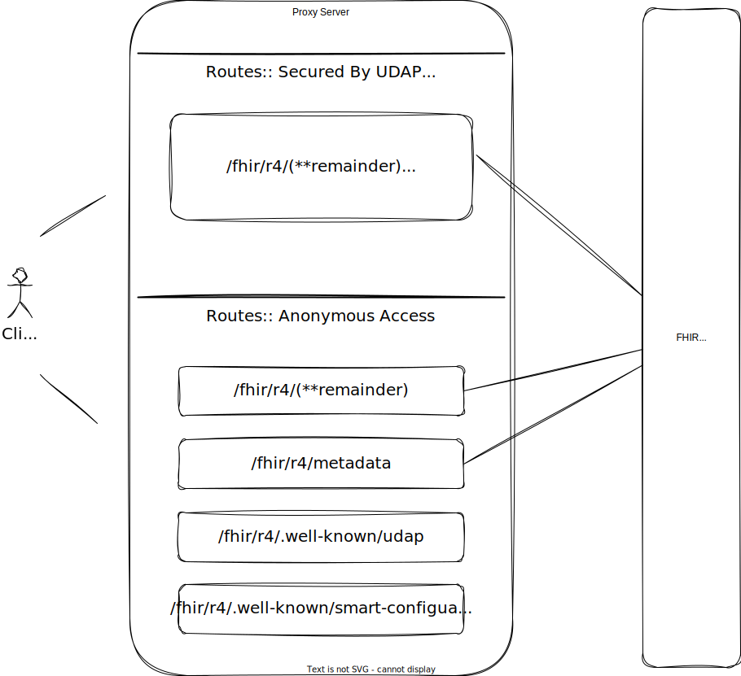

# TEFCA UDAP Proxy Server

Built on dotnet [YARP](https://microsoft.github.io/reverse-proxy/) (Yet Another Reverse Proxy) and ASP.NET Core.

A TEFCA-configured variant of the [UDAP Proxy Server](../Udap.Proxy.Server/), designed for TEFCA Facilitated FHIR exchange. Like the base proxy, it sits in front of an existing FHIR server and provides UDAP metadata and SMART on FHIR metadata endpoints via the [Udap.Metadata.Server](https://www.nuget.org/packages/Udap.Metadata.Server) and [Udap.Smart.Metadata](https://www.nuget.org/packages/Udap.Smart.Metadata) packages.

## TEFCA-Specific Features

- **Cloud secret mounting** for TEFCA-specific configuration (`/secret/tefcaproxyserverappsettings`, `/secret/udap.tefca.metadata.options.json`)
- **GCP Application Default Credentials (ADC)** for backend FHIR server authentication
- **Response URL transformation** — rewrites resource URLs from backend to proxy-facing URLs for paging and references
- **JWT claim forwarding** — extracts scopes and issuer from access tokens and passes them as custom headers to the backend FHIR server
- **FHIR metadata caching and transformation**

## Important Concepts

The proxy has anonymous routes and UDAP secured routes. To access FHIR resources, the client must follow UDAP Dynamic Client Registration and obtain an access token.

### Bearer Token

In this proxy scenario your FHIR server is secured by a standard bearer access token. The code implements a GCP ADC technique based on a GCP service account. There is also a simple AccessToken technique — set `ReverseProxy:Routes:Metadata:AccessToken` to the name of an environment variable supplying your access token. Or write your own.

### Transforms

URLs in FHIR resources (e.g., paging links) are transformed from backend URLs to proxy-facing URLs.

You will need to configure for your FHIR server. This example is configured for the FHIR server used by fhirlabs.net and includes the bits to deploy to a GCP Cloud Run application.
